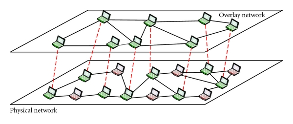
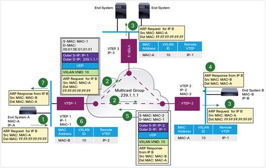

####overlay driver
* An overlay network is a computer network that is built on top of another network. 
Nodes in the overlay network can be thought of as being connected by virtual or logical links, each of which corresponds to a path, perhaps through many physical links, in the underlying network

* With the overlay driver, multi-host networks are first-class citizens inside Docker without external provisioning or components

* The `overlay` driver utilizes an industry-standard VXLAN data plane that decouples the container network from the underlying physical network (the underlay)
* VXLAN, encapsulates L2 into UDP. Tunneling using L3 means that no specialized hardware is required and such overlay networks could be build purely in software.

and when it comes to docker
* Docker overlay networks are used in the context of docker clusters (Docker Swarm), where a virtual network used by containers needs to span multiple physical hosts running the docker engine  
Swarm scopes overlay networks cannot be used for "docker run", only for services

Let's start by creating 2 swarm using docker-in-docker
~~~
10-docker-overlay-networking $ chmod +x docker-swarm.sh && ./docker-swarm.sh
~~~

let's check what we have

~~~
host$ manager docker network ls

NETWORK ID          NAME                DRIVER              SCOPE
fb9152b494ec        bridge              bridge              local
21ce4a33a60d        docker_gwbridge     bridge              local
7e6a5df179a3        host                host                local
c60vezcxgz45        ingress             overlay             swarm
541df91ecff5        none                null                local
~~~

and the network interfaces
 
~~~
host$ manager ip -f inet a
1: lo: <LOOPBACK,UP,LOWER_UP> mtu 65536 qdisc noqueue state UNKNOWN qlen 1
    inet 127.0.0.1/8 scope host lo
       valid_lft forever preferred_lft forever
10: docker0: <NO-CARRIER,BROADCAST,MULTICAST,UP> mtu 1500 qdisc noqueue state DOWN
    inet 172.17.0.1/16 scope global docker0
       valid_lft forever preferred_lft forever
15: docker_gwbridge: <BROADCAST,MULTICAST,UP,LOWER_UP> mtu 1500 qdisc noqueue state UP
    inet 172.18.0.1/16 scope global docker_gwbridge
       valid_lft forever preferred_lft forever
17: eth0@veth6b1cd7c: <BROADCAST,MULTICAST,UP,LOWER_UP> mtu 1500 qdisc noqueue state UP
    inet 172.19.0.2/16 scope global eth0
       valid_lft forever preferred_lft forever
~~~

let's create a `server` service

first, let's create an overlay network 

~~~

host$ manager docker network create mynet -d overlay && manager docker network ls
      4ggejqd5dwdcopvnd2kzlnept
      NETWORK ID          NAME                DRIVER              SCOPE
      57afefa915c7        bridge              bridge              local
      03b13d3c06e2        docker_gwbridge     bridge              local
      bdc1fbc9a3ab        host                host                local
      2vcl8lt8n2dr        ingress             overlay             swarm
      4ggejqd5dwdc        mynet               overlay             swarm
      323949152f62        none                null                local

~~~

now, let's assign it a `server` container
 
~~~
host$ manager docker service create --constraint 'node.labels.type == server' --replicas 2 --name server --network mynet -p 8000 busybox busybox httpd -f -p 8000
~~~

let's see the interfaces INSIDE the container. 

~~~
host$ server docker exec $(server docker ps -q -l) ip -f inet a
      1: lo: <LOOPBACK,UP,LOWER_UP> mtu 65536 qdisc noqueue qlen 1
          inet 127.0.0.1/8 scope host lo
             valid_lft forever preferred_lft forever
      23: eth2@if24: <BROADCAST,MULTICAST,UP,LOWER_UP,M-DOWN> mtu 1450 qdisc noqueue
          inet 10.0.0.4/24 scope global eth2
             valid_lft forever preferred_lft forever
          inet 10.0.0.2/32 scope global eth2
             valid_lft forever preferred_lft forever
      25: eth1@if26: <BROADCAST,MULTICAST,UP,LOWER_UP,M-DOWN> mtu 1500 qdisc noqueue
          inet 172.19.0.4/16 scope global eth1
             valid_lft forever preferred_lft forever
      29: eth0@if30: <BROADCAST,MULTICAST,UP,LOWER_UP,M-DOWN> mtu 1450 qdisc noqueue
          inet 10.255.0.8/16 scope global eth0
             valid_lft forever preferred_lft forever
          inet 10.255.0.6/32 scope global eth0
             valid_lft forever preferred_lft forever
 
host$ server docker inspect $(server docker ps -q -l)
....

"Networks": {
                "mynet": {
                    "IPAMConfig": {
                        "IPv4Address": "10.0.0.4"
                    },
                    "Links": null,
                    "Aliases": [
                        "9af35c726864"
                    ],
                    "NetworkID": "el9ygka1zeb3qc22zlwtnblr8",
                    "EndpointID": "574478db00f34651ae1ec607571cbd0ae8efe660ad37e7edf920a3997f205b1e",
                    "Gateway": "",
                    "IPAddress": "10.0.0.4",
                    "IPPrefixLen": 24,
                    "IPv6Gateway": "",
                    "GlobalIPv6Address": "",
                    "GlobalIPv6PrefixLen": 0,
                    "MacAddress": "02:42:0a:00:00:04"
                }
            }
....

~~~

let's check the server service
 
~~~
 
host$ for i in {1..5}; do curl localhost:8080/etc/hostname; done
      423d038c7e49
      0c6d3e316d58
      423d038c7e49
      0c6d3e316d58
      423d038c7e49
~~~
now, let's create a client service

~~~

host$ manager docker service create --mode global --name client --network mynet odedpriva/alpine-network top 

host$ manager docker inspect $(manager docker ps -q -f "name=client*")
...
"Networks": {
                "mynet": {
                    "IPAMConfig": {
                        "IPv4Address": "10.0.0.7"
                    },
                    "Links": null,
                    "Aliases": [
                        "4e15c6c05b78"
                    ],
                    "NetworkID": "2n1fvzbmdh3kzh9ic8dt51azx",
                    "EndpointID": "a1e26a9854dba4528f74790acca739d09e91cd215279b3935a9da0e9795a9670",
                    "Gateway": "",
                    "IPAddress": "10.0.0.7",
                    "IPPrefixLen": 24,
                    "IPv6Gateway": "",
                    "GlobalIPv6Address": "",
                    "GlobalIPv6PrefixLen": 0,
                    "MacAddress": "02:42:0a:00:00:07"
                }
            }
...

host$ manager docker exec  curl -s server:8080/etc/hostname
423d038c7e49
host$ manager docker exec client.0.eahc0gs79g75h6u2o8wtnef2y curl -s server:8080/etc/hostname
0c6d3e316d58

~~~

now, let's see how this magic happens

First let's investigate the external load balancing a.k.a routing mesh 
Routing mesh is a new feature in Docker 1.12 that combines ipvs and iptables to create a powerful cluster-wide transport-layer (L4) load balancer
When any Swarm node receives traffic destined to the published TCP/UDP port of a running service, it forwards it to service's VIP using a pre-defined overlay network called ingress

* each service gets a VIP 

~~~
host$ manager docker service inspect --format '{{.Spec.Name}}-{{json .Endpoint.VirtualIPs}}' $(manager docker service ls -q)
      server-[{"NetworkID":"ddxnkhz3tzaq2ce7sul7qofyk","Addr":"10.0.0.2/24"}]
      proxy-[{"NetworkID":"20408srk3176a0yeyjxdxkh28","Addr":"10.255.0.6/16"},{"NetworkID":"ddxnkhz3tzaq2ce7sul7qofyk","Addr":"10.0.0.5/24"}]
~~~

The service is given a Virtual IP address that is routable only inside the Docker Network. 
When requests are made to the IP address, they are distributed to the underlying containers. 
This Virtual IP is registered with the Embedded DNS server in Docker. 
When a DNS lookup is made based on the service name, the Virtual IP is returned.
DNS server is embedded inside Docker engine. Docker DNS resolves the service name and returns list of container ip addresses in random order. 
Clients normally will pick the first IP so that load balancing can happen between the different instance of the servers.

let's see this in action by monitoring networking on all nodes and containers .. 

the server node
~~~
host$ server docker run --rm --net=container:$(server docker ps  -l -q) crccheck/tcpdump not port 7946 and not port 2377 -i any --immediate-mode
# not port - filter out swarm communication among nodes (7946) and cluster management communications (2377)
# -i any - all interfaces
# --immediate-mode - don't buffer output. 
~~~

service discovery 

load balancing

ingress load balancing

The mynet (overlay) network - The ingress and egress point to the overlay network that VXLAN encapsulates and (optionally) encrypts traffic going between containers on the same overlay network

####links
http://www.slideshare.net/Docker/docker-networking-deep-dive
http://www.slideshare.net/Docker/docker-networking-control-plane-and-data-plane
https://www.youtube.com/watch?v=2EfOJhtjhIk
https://www.youtube.com/watch?v=2ihqKMDRkxM
http://securitynik.blogspot.co.il/2016/12/docker-networking-internals-container.html
https://www.katacoda.com/courses/docker-orchestration/load-balance-service-discovery-swarm-mode

 is the routing mash network, it is the only network created on all nodes.
* dns service is running inside the daemon. 
* the net1 network will be created on demand.
* docker_gwbridge is used as a gateway to the outer world

TCP port 2377 for cluster management communications.
TCP and UDP port 7946 for communication among nodes.
TCP and UDP port 4789 for overlay network traffic, (vxlan uses udp port 4789):
