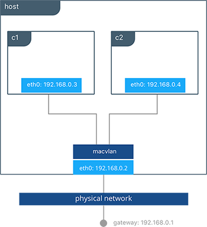

####macvlan driver
* MACVLAN or MAC-VLAN allows you to configure multiple Layer 2 (i.e. Ethernet MAC) addresses on a single physical interface
* The macvlan is a trivial bridge that doesn’t need to do learning as it knows every mac address it can receive, so it doesn’t need to implement learning or stp. Which makes it simple stupid and and fast.

| Bridge | MACVLAN  |
|:------:|------|
||| 

and when it comes to docker

* There are positive performance implication as a result of bypassing the Linux bridge, along with the simplicity of less moving parts, which is also attractive.    

####links
http://hicu.be/bridge-vs-macvlan
https://github.com/docker/labs/blob/master/networking/concepts/07-macvlan.md
